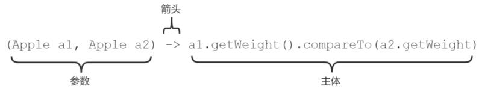
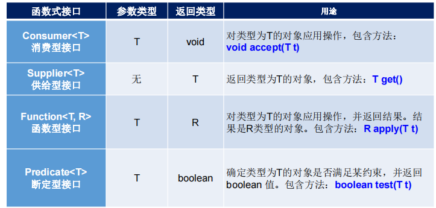
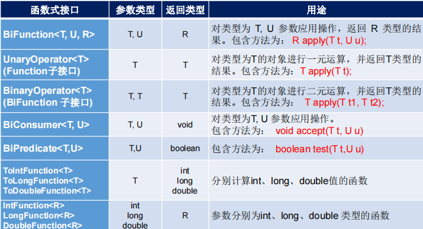

# Java8-NewFeature-strudy

## 1.lambda简介

Lambda 表达式是 JDK8 的一个新特性，可以取代大部分的匿名内部类，写出更优雅的Java代码，尤其在集合的遍历和其他集合操作中，可以极大地优化代码结构。 Lambda 表达式描述了一个代码块（或者叫匿名方法），可以将其作为参数传递给构造方法或者普通方法以便后续执行。

Lambda 表达式由三个部分组成：

1. 左侧参数：指定了 Lambda 表达式需要的参数列表 （其实就是函数式接口中的抽象方法的形参列表）
2. 中间箭头
3. 右侧主体： 是抽象方法的实现逻辑，（其实就是**重写**抽象方法的方法体）



**ps：个人理解在JAVA8中Lambda表达式的主要作用就是用来创建函数式接口的实例，然后函数式通常作为其他方法的参数传入**

## 2.函数式接口
* 函数式接口注释 @FunctionalInterface 只包含了一个抽象方法
  ```java
  /* @FunctionalInterface接口的描述
   * <p>Note that instances of functional interfaces can be created with
   * lambda expressions, method references, or constructor references.
   */
  @Documented
  @Retention(RetentionPolicy.RUNTIME)
  @Target(ElementType.TYPE)
  public @interface FunctionalInterface {}
  //* 作为一个Documented注释，不加@FunctionalInterface对于接口是否函数式接口没有影响，该注解知识提醒编译器去检查该接口是否仅包含一个抽象方法
  ```

### 2.1 自定义函数式接口

1. 自定义函数式接口

   ```java
   //自定义定义函数式接口,只有一个抽象方法。
   @FunctionalInterface
   public interface MyFuncInterf<T>{
        void work(String origin);
   }
   ```

2. 自定义以函数式接口为参数的方法

   ```java
   //自定义定义调用函数式接口的方法1
   public void printString(MyFuncInterf<String> mf, String origin){
       mf.work(origin);
   }
   
   //自定义定义调用函数式接口的方法2
   public void toLowerString(MyFuncInterf<String> mf, String origin){
       mf.work(origin);
   }
   ```

3. 用lambda表达式实例化函数式接口，lambda表达式实现具体业务

   ```java
   void test1() {
       //业务通过Lambda表达式传入
       toLowerString((str)->{
           System.out.println(str.toLowerCase());
       },"ABC");
   
       //System.out::println是方法引用
       //等价于lambda表达式:(str)->System.out.println(str)
       printString(System.out::println, "ABC");
   }
   ```

### 2.2 java8函数式接口

* JAVA8引入lambda的同时也添加了java.util.function包，其中包含了丰富函数式接口


* java.util.function中四个核心函数式接口原型

  

* 其他常用函数式接口

  

#### 2.2.1 Consumer< T> 

原型：

```java
//消费者：顾名思义只处理数据，不生产新的数据
//accept  接收数据
//andThen 链式的处理相同的输入数据。如果执行任一操作引发异常, 则将其转发给组合操作的调用者. 如果执行当前 Consumer 抛出异常, 则不会执行 after 操作.
@FunctionalInterface
public interface Consumer<T> {
    void accept(T t);

    default Consumer<T> andThen(Consumer<? super T> after) {
        Objects.requireNonNull(after);
        return (T t) -> { accept(t); after.accept(t); };
    }
}
```

用例：

```java
@Test
public void test2(){
    Consumer<String> consumer1 = (str) -> {System.out.println("Tips1：" + str + " 写入日志");};
    Consumer<String> consumer2 = (str) -> {System.out.println("Tips2：" + str + " 写入数据库");};
    Consumer<String> consumer3 = (str) -> {System.out.println("Tips3：" + str + " 给前端返回结果");};

    Consumer<String> consumer = consumer1.andThen(consumer2).andThen(consumer3);

    consumer.accept("修改用户名操作");
}
```

#### 2.2.2  Supplier< T>

原型：

```java
@FunctionalInterface
public interface Supplier<T> {
    T get();
}
```

用例：

```java
void test3() {
    Supplier<List<Person>> supplier= ()->{
        List<Person> personList = new ArrayList<Person>();
        personList.add(new Person(1,"张三","男",38));
        personList.add(new Person(2,"小小","女",2));
        personList.add(new Person(3,"李四","男",65));
        return personList;
    };

    List<Person> personList = supplier.get();
    //List的forEach方法接受一个Consumer<T>的函数式接口，所以可以使用lambda和方法引用
    personList.forEach(System.out::println);
}
```


#### 2.2.3 Function<T,R>

原型：

```java
@FunctionalInterface
public interface Function<T, R> {
    R apply(T t);
	
    default <V> Function<V, R> compose(Function<? super V, ? extends T> before) {
        Objects.requireNonNull(before);
        return (V v) -> apply(before.apply(v));
    }

    default <V> Function<T, V> andThen(Function<? super R, ? extends V> after) {
        Objects.requireNonNull(after);
        return (T t) -> after.apply(apply(t));
    }

    static <T> Function<T, T> identity() {
        return t -> t;
    }
```

应用:

```java
@Test
void test4() {
    Consumer<Integer> print = System.out::println;
    Function<Integer[],Integer> and = (args) -> (args[0]) + (args[1]);
    Function<Integer[],Integer> multi = (args) -> (args[0]) * (args[1]);

    //calculate: 4+5
    Integer[] integers1 = {4,5};
    print.accept(and.apply(integers1));

    //calculate: 2*3
    Integer[] integers2 = {2,3};
    print.accept(multi.apply(integers2));

}
```

#### 2.2.4 Predicat<T>

```java
@FunctionalInterface
public interface Predicate<T> {
    boolean test(T t);

    default Predicate<T> and(Predicate<? super T> other) {
        Objects.requireNonNull(other);
        return (t) -> test(t) && other.test(t);
    }

    default Predicate<T> negate() {
        return (t) -> !test(t);
    }

    default Predicate<T> or(Predicate<? super T> other) {
        Objects.requireNonNull(other);
        return (t) -> test(t) || other.test(t);
    }


    static <T> Predicate<T> isEqual(Object targetRef) {
        return (null == targetRef)
                ? Objects::isNull
                : object -> targetRef.equals(object);
    }
}
```

